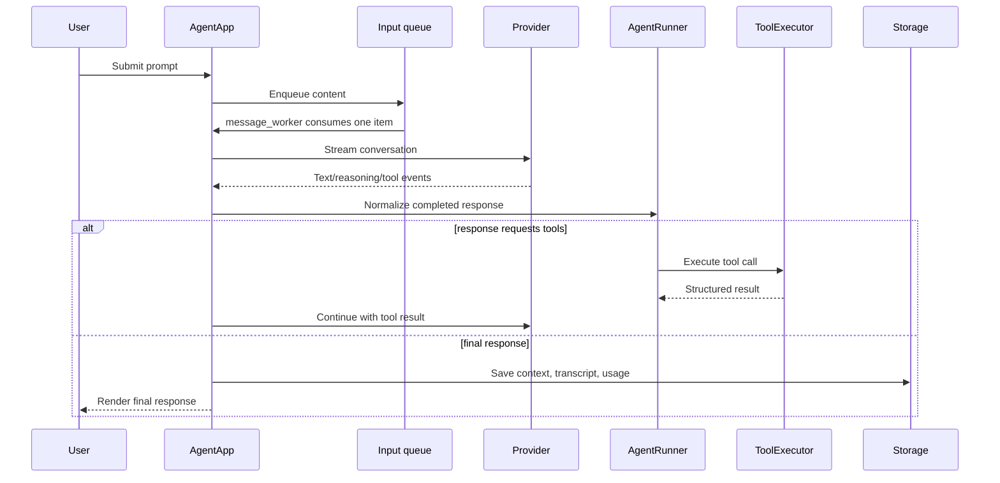

# Remie technical architecture

This document explains how Remie starts, how a user message travels through the
system, how providers and tools interact, and where state is persisted. It is
intended for contributors who need to debug or extend the project without first
reading every source file.

## 1. System overview

Remie is divided into six main layers:

```text
Textual frontend
    remie/tui/
          |
          v
Agent orchestration
    remie/core/
          |
          +-------------------+
          |                   |
          v                   v
Provider adapters         Tool executor
    remie/providers/          remie/tools/
          |                   |
          v                   v
Model APIs               Files, shell, web,
                         questions, memory

Cross-cutting services:
    remie/config.py       user-level configuration
    remie/storage/        project-level chats and memories
    remie/prompts.py      system prompt construction
    remie/protocol.py     textual tool-call parsing
    remie/tokens.py       token estimates
```

The intended dependency direction is from the UI toward the core and from the
core toward provider/tool interfaces. Providers and tools do not import
Textual.

## 2. Process startup

The installed command is declared in `pyproject.toml`:

```toml
[project.scripts]
remie = "remie.tui:main"
```

Python imports `remie.tui` and asks it for `main`. The package initializer is a
lazy compatibility facade: it does not eagerly import Textual, Pillow, every
modal, and every provider. Its `__getattr__()` resolves `main` from
`remie.tui.app` only when the command requests it.

The resulting call chain is:

```text
remie command
  -> remie.tui.__getattr__("main")
  -> remie.tui.app.main()
  -> AgentApp().run()
  -> Textual event loop
```

Root-level `main.py` is a development entry point for `uv run main.py`; it calls
the same `run_tui` compatibility alias.

## 3. Application initialization

`AgentApp.on_mount()` performs the project-level initialization:

1. Load the active connection from `~/.config/remie/config.json`.
2. Ensure the project has an active durable memory.
3. Load the latest chat from `.remie/chats/`, or create a new chat.
4. Repair native tool calls that were interrupted before receiving a result.
5. Rebuild the system prompt for the active provider.
6. Restore the visible transcript, prompt history, and cumulative token usage.
7. Prefetch OpenCode model metadata when needed.

Two forms of history are kept:

- **Context messages** are sent to the model. They include system messages,
  textual tool-result messages, native tool calls, and native tool outputs.
- **Transcript messages** are the user-visible history replayed into the TUI.

Keeping them separate allows Remie to preserve provider protocol details without
showing raw protocol messages as normal chat content.

## 4. System prompt construction

`remie/prompts.py` builds the system prompt through
`build_system_prompt(native_tools=...)`.

The result combines:

1. Base coding-agent instructions.
2. Tool instructions.
3. Textual tool descriptions for non-native providers.
4. Root-level `AGENTS.md`, limited to a safe context size.
5. The active project memory, also size-limited.

For local and OpenCode connections, the prompt explains the textual protocol:

```text
thinking: short explanation
tool: read_file({"filename":"main.py"})
```

For Codex and OpenRouter, tool schemas travel separately in the API request, so
the prompt tells the model to use native function calls instead.

The prompt is rebuilt before each user turn. It is also refreshed after the
memory tool adds or clears a note.

## 5. User-message flow

When the user presses Enter, the flow is:



### 5.1 Input queue

`AgentApp.on_prompt_submitted()` renders the user message immediately and puts
its content into an `asyncio.Queue`. `message_worker()` consumes queued messages
one at a time. This lets the user type while a previous response is running
without allowing two turns to mutate the same conversation concurrently.

Images are encoded as PNG data URLs and represented as multimodal message
parts before being queued.

### 5.2 Turn execution

The existing Textual turn path lives in `AgentApp.run_agent_turn()` because it
contains mature UI-specific streaming and repaint throttling. Provider-neutral
operations are delegated to `AgentRunner`:

- Parse textual tool calls.
- Normalize native function calls.
- Preserve exact native argument bytes.
- Build assistant tool-call metadata.
- Execute tools through `ToolExecutor`.
- Repair dangling tool calls.

`AgentRunner.run_turn()` also exposes a complete headless event-driven loop for
non-Textual frontends and tests. The TUI is being migrated incrementally rather
than replacing its streaming path in one risky rewrite.

## 6. Provider architecture

### 6.1 Common event contract

`remie/providers/base.py` defines the provider protocol:

```python
class Provider(Protocol):
    async def stream(
        self, conversation: list[dict[str, Any]]
    ) -> AsyncIterator[ProviderEvent]: ...
```

Providers emit typed events from `remie/providers/events.py`:

- `TextDelta`
- `ReasoningDelta`
- `ToolCallEvent`
- `UsageEvent`
- `FinishEvent`

`FinishEvent` carries the finish reason, truncation state, stream-completion
state, and provider metadata such as encrypted Codex reasoning items.

### 6.2 Routed provider

`RoutedProvider` in `remie/providers/router.py` translates all existing backend
clients into the common event stream. It accepts runtime dependencies such as
the HTTP client and local OpenAI client rather than importing TUI state.

For compatibility, `remie.agent.stream_llm_call()` converts typed events back
into the historical output arguments:

```text
usage_box
reasoning_box
finish_box
tool_calls_box
reasoning_items_box
```

This bridge allows old integrations and the optimized TUI stream renderer to
continue working while new code consumes typed events.

### 6.3 Local provider

The local provider uses the official asynchronous OpenAI client against a
configurable OpenAI-compatible `/chat/completions` endpoint. Local TLS
verification can be disabled for self-signed llama.cpp servers.

Tools use the textual protocol because compatible local servers do not always
implement native function calling consistently.

### 6.4 OpenCode Go

OpenCode uses direct HTTP SSE streaming against its OpenAI-compatible chat
completions endpoint. Model metadata is fetched from its `/models` endpoint and
cached for display and context-window calculations.

It also uses textual tool calls. Reasoning effort is disabled for models whose
OpenCode endpoint does not accept that parameter.

### 6.5 OpenRouter

`remie/openrouter_client.py` sends native tool schemas to OpenRouter and parses
its SSE chat-completion stream. Tool calls are reconstructed from streamed
argument fragments and emitted with call IDs.

Its public model catalog supplies display metadata and context-window sizes.

### 6.6 Codex

`remie/codex_auth.py` implements OAuth PKCE login and stores tokens in the
Codex-compatible `~/.codex/auth.json` file.

`remie/codex_client.py` uses the ChatGPT Codex Responses backend. It converts
Remie conversations to Responses API input items and handles:

- Text output events.
- Reasoning deltas.
- Native `function_call` items.
- Function-call outputs.
- Token usage.
- Authentication refresh.

Codex can require encrypted reasoning items that preceded a function call to be
replayed on the next request. Remie stores these items as `codex_reasoning` on
the assistant message and preserves the model's exact raw argument string.

## 7. Tool architecture

### 7.1 Registry and schemas

`remie/tools/registry.py` is the source of truth for model-callable tools. It
contains:

- The Python handler registry.
- Human-readable summaries.
- JSON argument schemas.
- Native function definitions generated by `get_tool_schemas()`.

The same registry supports textual prompt descriptions and native provider
schemas.

### 7.2 Execution

`remie/tools/executor.py` contains two layers:

- `execute_tool_call()` performs synchronous dispatch and normalizes historical
  argument aliases/defaults.
- `ToolExecutor` provides an asynchronous interface and runs blocking handlers
  in a worker thread.

`ask_user` is different from normal tools because it requires frontend input.
`ToolExecutor` receives an injected asynchronous callback, allowing Textual,
tests, or another frontend to provide its own implementation.

### 7.3 Tool results

For textual providers, a result is appended as a user message:

```text
tool_result({"content":"..."})
```

For native providers, it is appended with `role="tool"`, the tool name, and the
matching `tool_call_id`. Strict providers reject histories with an unanswered
call, so this pairing must remain valid.

### 7.4 Command safety

The shell tool applies timeouts, output limits, destructive-command patterns,
and optional `REMIE_BLOCKED_COMMANDS` rules. It is a guardrail, not an operating
system sandbox: commands still run with the current user's permissions.

## 8. Headless agent loop

`remie/core/runner.py` contains the provider-independent agent implementation.
Its `run_turn()` method:

1. Appends the user message.
2. Streams typed provider events.
3. Emits frontend-neutral events from `remie/core/events.py`.
4. Normalizes textual or native tool calls.
5. Retries bounded empty responses.
6. Continues responses truncated by an output limit.
7. Executes requested tools.
8. Appends correctly shaped tool results.
9. Repeats until it emits `TurnCompleted`.

Core events include:

- `TurnTextDelta`
- `TurnReasoningDelta`
- `ToolStarted`
- `ToolCompleted`
- `TurnRetrying`
- `TurnUsage`
- `TurnCompleted`

Because this package does not import Textual, it can support a future plain CLI,
web server, test harness, or other frontend.

## 9. Context and token management

`remie/tokens.py` provides provider-independent estimates when an API does not
report exact usage. The approximation uses character and newline counts and is
cheap enough to update during streaming.

The TUI maintains a cached estimate for the full conversation. When the
conversation reaches a configured fraction of the model's context window:

1. Older messages are selected.
2. The active model summarizes them into a compact session note.
3. The original messages are replaced by the summary.
4. A recent tail of messages remains verbatim.

If summarization fails, Remie inserts a generic omission note instead of
crashing the turn.

Provider-reported usage replaces estimates when available. Cumulative input and
output counts are persisted per chat.

## 10. Persistence

### 10.1 Global configuration

`remie/config.py` owns connection configuration. `ConfigStore` is path-injected,
which makes it testable without writing to the user's home directory.

The default location is:

```text
~/.config/remie/config.json
```

It stores:

- Active provider.
- One profile per provider.
- API keys and URLs.
- Selected model.
- Reasoning effort.
- TLS preference.
- TUI status-animation preference.

`remie.agent` retains compatibility wrappers around `ConfigStore` and owns the
currently active runtime connection and lazily created HTTP clients.

### 10.2 Project chat storage

`remie/storage/chats.py` stores chats under:

```text
.remie/chats/
```

Each chat contains context messages, transcript messages, title metadata, and
token usage. Index updates use atomic JSON writes where required.

`remie/tools/chats.py` remains only as a compatibility re-export.

### 10.3 Durable memories

`remie/storage/memories.py` stores named UUID-backed memories under:

```text
.remie/memory/
```

`remie/tools/memory.py` is the model-callable adapter around that storage. The
active memory ID is stored separately and its content is injected into the next
system prompt.

## 11. TUI responsibilities

The Textual frontend is intentionally split by responsibility:

- `app.py` — application lifecycle, queue, and UI-aware turn rendering.
- `chat_session.py` — chat save/load/replay and session state.
- `streaming.py` — live reasoning and token-speed presentation.
- `widgets.py` — prompt, status indicator, model badge, and streaming log.
- `render.py` — tool-result and syntax-highlighted rendering.
- `screens/` — connection, chat, memory, and user-question modals.
- `contracts.py` — runtime-safe app identification without circular imports.

`StreamingPresentationMixin` drains reasoning while normal content is silent.
Markdown rendering is throttled because reparsing and relayout on every token is
expensive. The final stream panel is replaced with fully rendered reasoning and
assistant panels after completion.

`ChatSessionMixin` keeps persistence concerns out of the main application class
and owns transcript replay, chat switching, token restoration, and save-on-exit.

## 12. Cancellation and recovery

Pressing Escape sets the stop flag, drains pending queued messages, and cancels
the active worker task.

Cancellation can occur after a native function call was recorded but before its
result was appended. `AgentRunner.close_dangling_tool_calls()` repairs this by
inserting an explicit interrupted result for each unanswered call. Repair runs:

- When a chat is loaded.
- Before a new turn.
- Before a chat is saved.

The operation is idempotent and leaves already answered calls unchanged.

## 13. Errors

Shared provider exceptions live in `remie/errors.py`:

- `LLMRequestError` represents a non-success model response.
- `UnsupportedModelError` represents unsupported provider/model behavior.

The TUI converts transport errors, timeouts, context-limit errors, authentication
problems, and general exceptions into user-facing notifications while keeping
the application responsive.

## 14. Compatibility facades

The refactor preserves historical imports:

```python
from remie.agent import configure_openai, run_tool, get_full_system_prompt
from remie.tui import AgentApp, MAX_AUTO_CONTINUATIONS
```

Clearer canonical names are available:

```python
set_active_connection
execute_tool_call
build_system_prompt
```

`remie.agent` and `remie.tui` resolve many compatibility exports lazily. This
keeps old integrations working without forcing every dependency to load at
module import time.

## 15. Extending Remie

### Add a tool

1. Implement the handler in `remie/tools/`.
2. Add it to `TOOL_REGISTRY`.
3. Add its summary and JSON schema.
4. Add dispatch normalization if its arguments need compatibility handling.
5. Add registry, executor, and integration tests.

### Add a provider

1. Add provider defaults and configuration fields.
2. Implement or adapt its stream into `ProviderEvent` values.
3. Add model discovery to `providers/catalog.py` if applicable.
4. Add it to provider routing.
5. Decide whether it uses native or textual tools.
6. Add provider contract tests for text, reasoning, tools, usage, finish state,
   errors, and cancellation.
7. Add connection-screen options and validation.

### Add a frontend

1. Construct a `Provider` and `ToolExecutor`.
2. Inject a frontend-specific `ask_user` callback.
3. Consume `AgentRunner.run_turn()` events.
4. Render text/reasoning/tool/usage events in the frontend's own way.
5. Use `storage/`, `prompts.py`, and `config.py` rather than importing Textual.

## 16. Testing strategy

The test suite separates concerns:

- `test_agent.py` — compatibility API, configuration, parsing, streaming.
- `test_core.py` — headless loop, tool pairing, provider events.
- `test_codex.py` — Responses API conversion and OAuth-sensitive behavior.
- `test_openrouter.py` — OpenRouter payload and SSE behavior.
- `test_tui.py` — Textual interactions, rendering, persistence workflows.
- `test_web.py` — web tools and schemas.
- `test_imports.py` — lazy-import regressions.

Provider and core tests use fake streams so normal test runs do not require API
keys or network access.

## 17. Practical debugging path

For an end-to-end failure, trace the system in this order:

```text
Prompt submission
  remie/tui/app.py
      -> message_worker()
      -> run_agent_turn()

Provider routing
  remie/agent.py::stream_llm_call()
      -> remie/providers/router.py
      -> codex_client.py / openrouter_client.py / local/OpenCode path

Response interpretation
  remie/core/runner.py::prepare_response()
      -> remie/protocol.py for textual calls

Tool execution
  remie/tools/executor.py
      -> concrete handler

Persistence
  remie/tui/chat_session.py
      -> remie/storage/chats.py
```

Start from the first incorrect boundary rather than patching the final visible
symptom. Add a regression test at that boundary before changing behavior.
